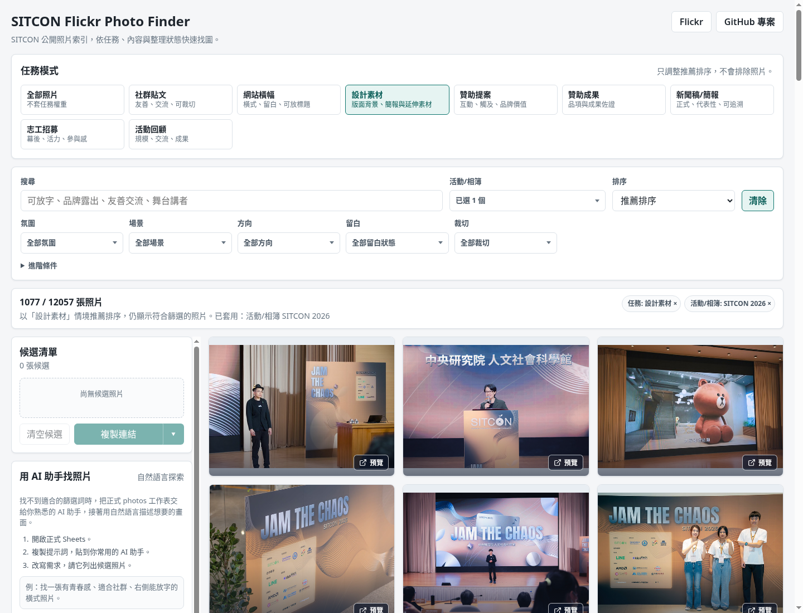
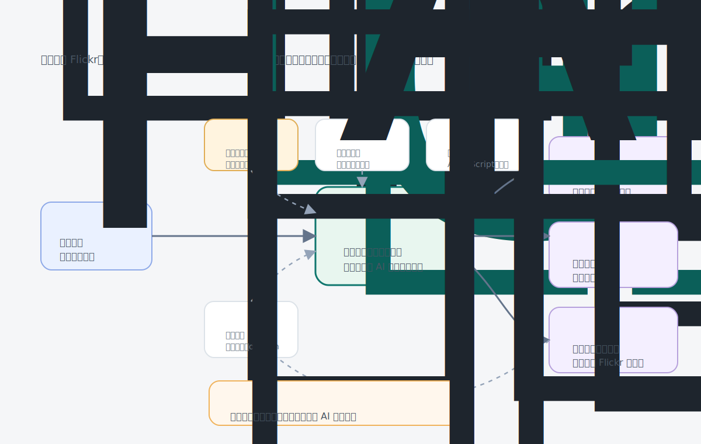
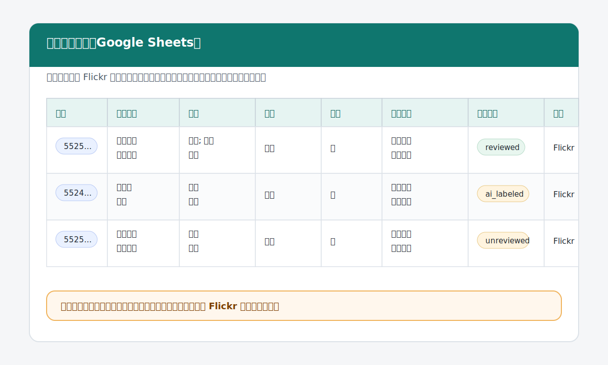

# SITCON Flickr Photo Finder

SITCON Flickr Photo Finder 把 SITCON Flickr 上的公開活動照片，整理成一份可搜尋、可協作、可由 AI 協助初標但仍由人審核的照片索引。

它不是要取代 Flickr，也不是把原圖保存到這裡。照片仍在 Flickr；這個專案建立的是一層「找得到、看得懂、能持續維護」的索引，讓籌備團隊可以依照社群貼文、活動回顧、贊助成果、新聞稿等真實需求找照片。

[立即體驗公開搜尋前端](https://sitcon.org/flickr-photo-finder/) · [查看正式照片索引](https://docs.google.com/spreadsheets/d/1JM2QzJo5kpeILZPyTSE6gUK3z-FyRcaGhPJlYE-FMbs/edit) · [瀏覽 SITCON Flickr 相簿](https://www.flickr.com/photos/sitcon/albums/)



## 這能幫你做什麼

| 需求 | 可以怎麼找 |
| --- | --- |
| 社群貼文 | 找有互動感、青春感、可裁切的照片，整理成候選清單。 |
| 活動回顧 | 找能呈現流程、規模、交流、講者、工作人員與現場氛圍的照片。 |
| 贊助成果 | 找會眾互動、攤位、品牌露出或活動規模的佐證照片。 |
| 新聞稿 | 找正式場合、舞台、講者、合照或活動識別清楚的照片。 |

網站視覺、簡報、志工招募等需求，也可以從同一份索引延伸篩選。

找不到照片也很重要。它會提醒我們：欄位可能不夠貼近工作需求、分類需要補強，或 AI 初標提示詞還需要調整。

## 這套方法怎麼運作



核心設計很簡單：

- 公開照片不等於找得到；活動工作需要可搜尋的索引。
- 正式照片索引放在 Google Sheets，讓志工可以一起整理與審核。
- 這個專案提供規則與工具：定義照片索引怎麼整理、協助從 Flickr 匯入照片、支援 AI 初標與人工審核，並提供公開搜尋前端與維護文件。
- AI 只能提出候選標註，不能直接把照片變成已審核。
- 搜尋前端與常用 AI 助手都讀同一份公開索引，不再製造第二套資料。

## 資料如何被整理



每一列是一張 Flickr 照片。除了原始 Flickr 連結，也會整理用途、場景、氛圍、人物數量、照片方向、是否有留白、贊助相關線索、使用提醒與整理狀態。

這些欄位不是為了把資料做得漂亮，而是為了回答實際問題：這張照片適合放社群嗎？能支援活動回顧或新聞稿嗎？可以作為贊助成果佐證嗎？發布前還需要誰確認？

## 信任與邊界

- 正式照片索引放在 Google Sheets；`fixtures/*.csv` 只是本機範例與測試資料。
- Flickr 仍是照片與相簿來源；發布或交付素材前，請回 Flickr 原頁確認脈絡。
- 這個專案不保存 Google credential、OAuth token、AI API key 或私人連結。
- GitHub Pages 公開前端只能讀資料，不能寫入正式索引。
- AI 初標只是候選資料；`ai_labeled` 不等於 `reviewed`。
- `curation_notes` 等欄位會進入公開索引，不應放敏感內部資訊。

## 想深入或協作

| 你想做的事 | 建議入口 |
| --- | --- |
| 只想找照片 | [公開搜尋前端](https://sitcon.org/flickr-photo-finder/) |
| 用自己熟悉的 AI 助手找照片 | [`docs/ai-readable-dataset.md`](docs/ai-readable-dataset.md) |
| 協助整理照片資料 | [`docs/data-entry-guide.md`](docs/data-entry-guide.md) |
| 理解整體架構 | [`docs/project-architecture.md`](docs/project-architecture.md) |
| 看完整文件、狀態與工具索引 | [`docs/README.md`](docs/README.md) |

技術志工第一次接觸專案，可以先用互動入口了解目前能做的工作：

```bash
pnpm workflow
```

常用的本機檢查與體驗入口：

```bash
pnpm finder:dev
pnpm data:validate
```

完整命令清單、Sheets 流程、AI 初標流程、Apps Script 維護與 GitHub Pages 部署說明，請從 [`docs/README.md`](docs/README.md) 進入。

## 授權與協作

這個專案的程式碼、文件、欄位設計、分類、提示詞與工具預設採用 Apache-2.0 授權，詳見 [`LICENSE`](LICENSE)。

這份授權不代表 SITCON Flickr 上的原始照片被重新授權。照片本身的來源、授權與使用脈絡，仍應以 Flickr 原頁為準。

歡迎用 issue 或 pull request 協助改善欄位設計、分類、AI 初標規則、資料流程、文件與公開搜尋前端。協作方式請看 [`CONTRIBUTING.md`](CONTRIBUTING.md)。
