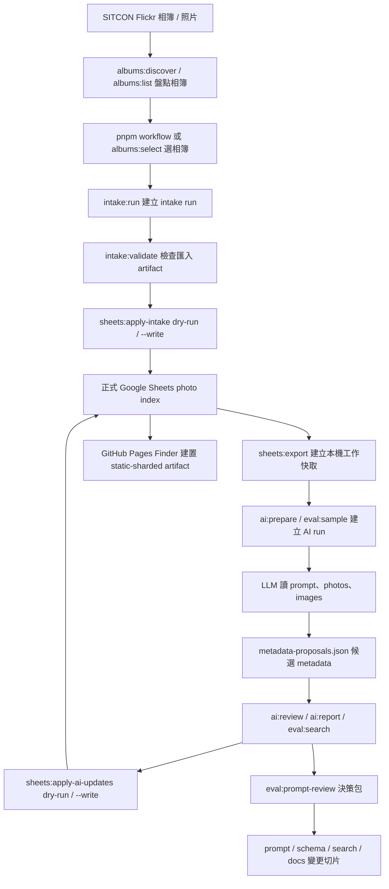
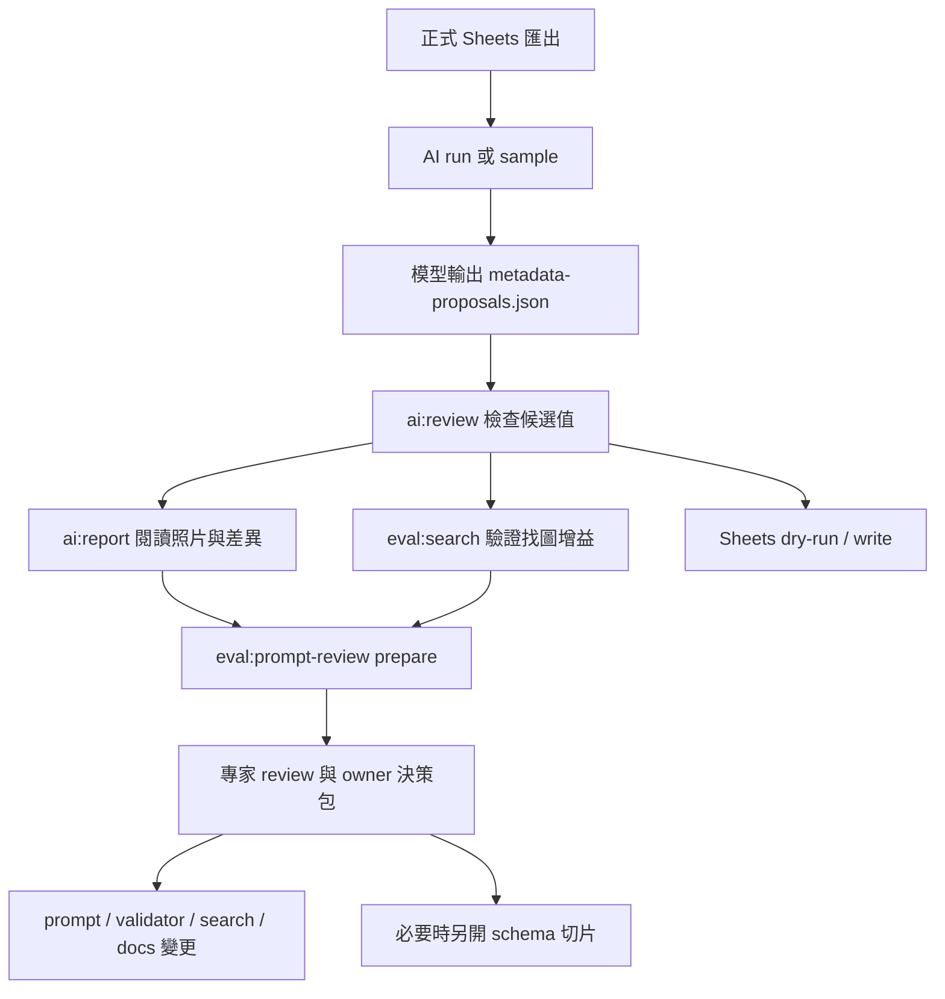

# 文件入口與狀態

這份文件整理 `docs/` 內文件的閱讀入口、目前狀態與真理來源。若其他文件和本文件的狀態描述不同，應優先回到這裡更新並修正矛盾。

## 先建立共同語言

第一次接手專案時，先看本節和下一節的資料生命週期，再依任務導向入口選 runbook。這個專案的核心不是取代 Flickr，而是在 Flickr 與 Google Sheets 之間建立可驗證、可回寫、可搜尋、可由 AI 輔助但仍由人類審核的照片索引層。

| 名詞 | 在本專案的意思 |
| --- | --- |
| 正式 Sheets | Google Sheets 中的正式照片索引，是 `photos`、`albums`、`import_batches`、`taxonomy` 與 `sponsorship_items` 的權威資料來源。 |
| 本機工作快取 | `tmp/sheets-export/*.csv`，由 `pnpm sheets:export` 從正式 Sheets 匯出，供本機 validation、intake 與 AI 工具使用；可重建，不 commit。 |
| intake run | `tmp/intake-runs/<run-id>/`，一次 Flickr 相簿匯入的可審核 artifact，包含候選照片、相簿更新、匯入批次與摘要；人類確認後才用 `sheets:apply-intake` dry-run/write。 |
| AI run | `tmp/ai-runs/<run-id>/`，一次 AI 初標工作包，通常由 `ai:prepare` 或 `eval:sample` 建立，包含 `manifest.json`、`photos.json`、`images/`、`ai-labeling-prompt.md`，模型完成後才加入 `metadata-proposals.json`。AI run 不是人工 review 狀態。 |
| attempt | 從既有 AI run 派生的模型/輪次比較工作包，仍符合 AI run 目錄合約，用來比較不同模型、prompt 或 rounds。 |
| prompt review 決策包 | `tmp/prompt-reviews/<review-id>/`，由 `eval:prompt-review` 產生，只彙整 evidence、專家 review 與 owner 決策，不自動呼叫外部 LLM、不改 prompt/schema、不寫 Sheets。 |

## 整體資料生命週期

端到端主線是：從 Flickr 盤點相簿與照片，產生可審核的 intake artifact，經 dry-run/write 寫入正式 Sheets；公開前端讀正式 Sheets 公開資料；AI 初標與 eval 只在正式 Sheets 匯出的工作快取或 sample 上產生候選與決策 artifact，最後仍要回到 Sheets dry-run/write 與人工 review 邊界。

## 任務導向入口

如果你是以「我要完成什麼」進入專案，先用下表選一個最合適入口；需要確認資料權威、共用字串或文件分工時，再看後面的真理來源表與文件分工。這裡是第一層分流，不是完整 runbook、命令清單或 artifact inventory。

### 找圖與資料整理

| 任務 | 先從這裡開始 | 補讀或邊界提醒 |
| --- | --- | --- |
| 我要找社群、回顧、贊助或新聞稿可用照片 | [公開搜尋前端](https://sitcon.org/flickr-photo-finder/) | 正式找圖入口讀取 Google Sheets 公開資料；本機前端預覽才用 `pnpm finder:dev`，資料流看 `docs/public-frontend-architecture.md`。 |
| 我第一次整理照片，想先練習 | Google Sheets `使用說明` | 從正式照片索引進入固定練習表，不要直接在正式資料試填；整理判斷補讀 `docs/data-entry-guide.md`。 |
| 我要正式補照片欄位或檢查授權/用途 | [正式照片索引](https://docs.google.com/spreadsheets/d/1JM2QzJo5kpeILZPyTSE6gUK3z-FyRcaGhPJlYE-FMbs/edit) | 欄位速查看 `docs/photo-fields-reference.md`；欄位順序、reviewed 完整度與 approved 要求仍以 `data/photo-schema.json` 為準。 |
| 我要匯入新 Flickr 相簿 | `pnpm workflow` | 從互動式流程選相簿、建立 intake run、接續 validation 與 Sheets dry-run；Sheets 同步邊界看 `docs/sheets-sync-workflow.md`。 |
| 我要跑 AI 初標 | `pnpm workflow` | 從 AI prepare 流程建立 `tmp/ai-runs/` 工作包；模型輸出合約看 `docs/ai-labeling-contract.md`。 |
| 我要確認 AI 建議能不能採用 | `docs/ai-labeling-operator-guide.md` | 實際檢查候選值用 `pnpm ai:review -- --run-dir <dir>`；AI 候選值不等於 `reviewed`。 |
| 我要比較模型、prompt 或搜尋增益 | `pnpm eval` | 這是評估入口，不是一般照片整理主線；需要多專家 prompt 決策包時用 `pnpm eval -- --task prompt-review` 或 `pnpm eval:prompt-review`。 |

### 維護與開發

| 任務 | 先從這裡開始 | 補讀或邊界提醒 |
| --- | --- | --- |
| 我要修改公開前端 | `docs/public-frontend-architecture.md` | 先確認正式資料來源、本機 fixture/export 模式、前端模組邊界、artifact build/check 與 GitHub Pages 部署邊界。 |
| 我要修改 Apps Script | `docs/apps-script-maintenance-design.md` | 先確認 clasp 綁定、target、GeneratedConfig、Sheets-side validation 與練習表/正式表邊界。 |
| 我要修改 taxonomy 或欄位 schema | `真理來源` 與 `共用字串歸屬` | 實際 source 是 `data/tag-taxonomy.json` 與 `data/photo-schema.json`；改完需依影響範圍同步 Apps Script、前端或 validation，並執行 `pnpm data:validate`。 |
| 我要修改 filter、task mode、URL key 或跨介面 field set | `docs/shared-value-governance.md` | Interface policy 來源是 `data/interface-registry.json`；改完需重新產生 Apps Script config 並執行 `pnpm shared-values:check`。 |
| 我要部署或檢查 Pages artifact | `pnpm workflow -- --task pages-build` | workflow 是日常入口；低階檢查可用 `pnpm finder:build` 後接 `pnpm finder:check`。部署版預設產生 static-sharded finder data；runtime CSV 只作為 fallback。 |
| 我要維護 Sheets 同步或練習表 | `docs/sheets-sync-workflow.md` | 先確認正式表、練習表、service account 與 dry-run/write 邊界。 |
| 我要檢查正式 Sheets 資料健康度 | `pnpm sheets:report` | 先用 `pnpm sheets:export` 更新 `tmp/sheets-export/`；風險分級與後續處理看 `docs/sheets-sync-workflow.md`。 |
| 我要管理 GA4 事件與 custom dimensions | `docs/frontend-analytics-design.md` | 後台權限與 Admin API 操作看 `docs/ga4-operations.md`。 |
| 我要理解架構決策背景與維護邊界 | `docs/adr/README.md` | ADR 只記錄決策脈絡、取捨與維護邊界；目前架構總覽仍看 `docs/project-architecture.md`。 |

## AI 評估與決策子流程

上方生命週期中的 AI run 可以再展開成候選 metadata、評估與決策路線。一般照片整理仍走 `pnpm workflow`，模型、prompt、搜尋增益評估走 `pnpm eval`，需要 owner 決策前再用 `pnpm eval:prompt-review` 收斂 evidence 與專家意見。`prompt-review` 只產生 review artifact，不自動呼叫外部 LLM、不修改 prompt/schema、不寫 Google Sheets。

| 讀者 | 主要閱讀入口 | 不應混用的脈絡 |
| --- | --- | --- |
| 人類操作者 | `docs/ai-labeling-operator-guide.md`、`docs/ai-labeling-contract.md` | AI 候選值不等於人工 `reviewed` 或公開 `approved`。 |
| 只負責初標的 LLM / agent | run 目錄的 `ai-labeling-prompt.md`、`docs/ai-labeling-contract.md`、schema、taxonomy、sponsorship items、`photos.json` 與圖片 | 不要把 operator guide、Sheets 回寫文件或先前 proposal 當成照片內容依據。 |
| repo 維護 agent | `AGENTS.md`、`docs/agent-maintenance-guide.md`、本文件 | 操作流程前先確認 source-of-truth 文件與 run artifact。 |
| prompt review 專家 agent | `tmp/prompt-reviews/<review-id>/input-manifest.json`、`expert-prompts/`、run 的 `metadata-review-summary.md`、`docs/ai-labeling-prompt-expert-review.md` | 專家 review 只做唯讀分析；決策包不會自動套用建議。 |

## 真理來源

| 資訊 | 真理來源 | 備註 |
| --- | --- | --- |
| 照片、相簿與匯入批次欄位、欄位順序、reviewed 完整度 | `data/photo-schema.json` | 文件可以解釋判斷理由，但不應重複維護欄位清單。 |
| 受控字彙、列舉值與人類顯示文字 | `data/tag-taxonomy.json` | Apps Script、Sheets 下拉選單、GitHub Pages、文件與 validation 應從這份資料衍生。`option_labels` 是 raw value 的唯一顯示文字來源。 |
| 資料值搜尋同義詞 | `data/search-aliases.json` | 只放 raw value 的搜尋別名，供 GitHub Pages 與離線搜尋評估共用；不要放單一畫面的任務文案。 |
| 公開欄位敏感內容 warning 規則 | `data/public-sensitive-content-rules.json` | 用於本機 validation 與 Apps Script validation report；warning 不等於 hard fail，人工判斷與例外處理看 `docs/database-collaboration-strategy.md`。 |
| filter、task mode、URL key、狀態排序與跨介面欄位集合 | `data/interface-registry.json` | 只引用 schema/taxonomy 既有欄位與值，不新增資料契約；詳細分層見 `docs/shared-value-governance.md`。 |
| SITCON 2026 CFS 贊助品項 | `data/sponsorship-items.json` | 這是固定版本資料，不自動追遠端更新。 |
| 組織名稱、Flickr 帳號、GitHub 專案連結與前端標題 | `config/project.json` | SITCON 是此 repo 的預設實例；其他組織 fork 時應先改這份設定。 |
| 公開 Google Sheets ID | `config/project.json` 的 `googleSheets.spreadsheetId` | 這份 Sheets 預期可公開讀取；寫入權限由 Google Drive/Sheets 管理。 |
| GitHub Pages 前端資料流、本機資料來源與部署 artifact | `docs/public-frontend-architecture.md` | 前端現況 runbook；`pnpm finder:dev`、`pnpm finder:dev:fixture`、`pnpm finder:dev:export` 的差異以這份為準。 |
| 公開前端代理使用者研究 | `docs/public-frontend-agent-research.md` | 重構前的多角色代理研究快照；不等同真人訪談，也不是目前缺口清單。 |
| 公開前端手機版代理研究 | `docs/public-frontend-mobile-research.md` | 針對 #5 手機版重設計的代理深訪與 owner 評估紀錄；不等同真人訪談或已完成 usability test。 |
| 公開前端重構需求簡報 | `docs/public-frontend-redesign-brief.md` | GitHub Pages 前端重構的歷史需求基準與驗收 baseline；目前已完成多數 P0/P1。 |
| 前端使用行為分析設計 | `docs/frontend-analytics-design.md` | 導入 GA4 或分析前，先確認目前前端狀態、事件邊界、隱私限制與後續分析流程。 |
| GA4 後台操作與 service account 權限 | `docs/ga4-operations.md` | 管理 GA4 權限、service account 加入 property、custom dimensions 與 BigQuery 延後策略。 |
| GA4 custom dimensions 註冊清單 | `config/ga4-custom-dimensions.json` | 低基數 event-scoped custom dimensions 的 repo source of truth；不要加入 `photo_id`、`content_id`、`search_term`、`result_rank`。 |
| GA4 前端 measurement ID | `config/project.json` 的 `frontend.ga4MeasurementId` | 給 GitHub Pages 前端送出 GA4 event 使用。 |
| GA4 後台 property ID | `config/project.json` 的 `frontend.ga4PropertyId` | 給 GA4 Admin API 與 custom dimensions 管理工具使用；它不是 credential 或 secret。 |
| Sheets 表格讀寫技術選擇 | `docs/sheets-sync-workflow.md` | repo CLI 應以官方 Google Sheets API SDK 為主要方向；Google Drive 檔案搬運不是 Sheets 寫入主流程。 |
| Sheets 正式寫入身份 | `docs/sheets-sync-workflow.md` | 建議使用 SITCON 管理的 service account，並將 service account email 加入正式 Sheets 編輯者。 |
| AI 初標輸入與輸出格式 | `docs/ai-labeling-contract.md` | 定義 `tmp/ai-runs/<run-id>/` 的輸入檔、圖片來源、`metadata-proposals.json` 格式與驗證流程。 |
| AI 初標操作與 prompt | `docs/ai-labeling-operator-guide.md`、`prompts/ai-labeling.md` | 操作指南給人類操作者與 repo 維護 agent；prompt 是可交給模型使用的任務範本。 |
| AI 初標品質評估 | `docs/ai-labeling-evaluation-notes.md` | 記錄模型 run 觀察、常見失準欄位與未來可工具化的檢查方向。 |
| AI 初標 prompt 專家審查決策 | `docs/ai-labeling-prompt-expert-review.md` | 記錄多專家 prompt review 的角色、共識、owner 決策與後續切片；本機 review artifact 留在 `tmp/prompt-reviews/`。 |
| 跨活動 AI 測試抽樣計畫 | `data/ai-cross-activity-sample-plan.json` | 用於建立欄位、taxonomy、prompt 與 validator 評估工作包；不是正式照片資料。 |
| AI proposal 範例 | `fixtures/ai-proposals/` | valid/invalid examples 應由 `pnpm eval:validate-fixtures` 驗證。 |
| AI 初標 review 後續交接提示 | `scripts/commands/review-ai-run.mjs` | CLI `Next:` 與 `metadata-review-summary.md` 的 `## Next Commands` 應和目前報表、比較、dry-run 流程同步。 |
| 正式照片索引資料 | Google Sheets `photos` | repo 內 `fixtures/photos.csv` 只是 sample、fixture 與匯出格式參考。 |
| 正式相簿清單資料 | Google Sheets `albums` | repo 內 `fixtures/albums.csv` 只是 sample、fixture 與匯出格式參考。 |
| 正式匯入批次資料 | Google Sheets `import_batches` | repo 內 `fixtures/import-batches.csv` 只是 sample、fixture 與匯出格式參考。 |
| 本機 Sheets 工作快取 | `tmp/sheets-export/*.csv` | 從正式 Google Sheets 匯出，供 validation 與 intake 使用；可刪除，不 commit。 |
| 正式表 Apps Script ID | `config/project.json` 的 `googleSheets.appsScriptId` | 這是正式表的 Sheet-bound Apps Script 專案 ID，供維護者重建本機 `clasp` 綁定；它不是 Google credential、OAuth token 或部署權限。 |
| 固定練習用 Google Sheets ID | `config/project.json` 的 `googleSheets.practiceSpreadsheetId` | 這份 Sheets 供教學與試驗編輯；它不是第二份正式資料庫，寫入權限由 Google Drive/Sheets 管理。 |
| 固定練習用 Apps Script ID | `config/project.json` 的 `googleSheets.practiceAppsScriptId` | 這是練習表的 Sheet-bound Apps Script 專案 ID，供維護者重建本機 `clasp` 綁定；它不是 Google credential、OAuth token 或部署權限。 |
| 練習用試算表資料包 | `tmp/sheets-practice/*.csv` | 從正式匯出資料切出的小樣本，供維護者重置固定練習表；可刪除，不 commit，不是第二份正式資料庫。 |
| 專案角色與資料流 | `docs/project-architecture.md` | 若架構改變，先更新架構總覽，再同步相關文件。 |
| 架構決策脈絡與維護邊界 | `docs/adr/README.md` | ADR 不取代架構總覽或 runbook；用來理解已採用決策的背景、取捨與長期維護方式。 |

## 共用字串歸屬

資料欄位、受控字彙、狀態與驗證規則會同時出現在 Google Sheets、GitHub Pages、Apps Script、AI report 與 CLI。新增或調整字串時，先判斷它屬於哪一層：

| 字串類型 | 維護位置 | 使用原則 |
| --- | --- | --- |
| 欄位名稱與欄位說明 | `data/photo-schema.json` | 人類介面與報表應使用 `label_zh` / `description_zh`，儲存與比對仍使用欄位 raw key。 |
| taxonomy / boolean raw value 的人類顯示文字 | `data/tag-taxonomy.json` 的 `option_labels` | 不在 Pages、Apps Script、文件或報表另寫翻譯表。 |
| sponsorship item 名稱 | `data/sponsorship-items.json` 衍生到 taxonomy | 沿用 CFS 快照名稱，不另創平行詞彙。 |
| raw value 的搜尋同義詞 | `data/search-aliases.json` | 只放會跨搜尋介面共用的別名；任務模式與 query 提示仍屬於各自產品介面。 |
| Apps Script 即時驗證文案 | `data/validation-messages.json` | 後端驗證與 sidebar 即時提示共用；不要在 HTML 內另寫同一組錯誤訊息。 |
| 人類審核輸出格式 | `scripts/lib/core/metadata-display.mjs` | CLI diff、report、CSV 等人類輸出應共用這個 helper，機器 JSON plan 維持 raw value。 |
| 版本與狀態描述 | 具體日期、hash、schema version、header shape 或目前 repo source | 避免用「新 / 舊 / 最新」搭配版本的相對詞。若是 prompt 差異，寫出 prompt hash 或「目前 repo prompt」；若是 Sheets 格式差異，寫出實際 header。 |
| 跨介面 UI policy | `data/interface-registry.json` | Pages、Apps Script 或 CLI 需要共用 filter、field set、URL key 或狀態排序時，先登錄 registry，再由使用端讀取或檢查。 |
| 單一畫面的操作文案 | 該畫面程式或文件 | 例如按鈕、空狀態與提示文字可留在當地；若跨兩個以上介面重複，應提升成共用來源。 |

## 目前狀態

### 目前可用

- `pnpm workflow`，先說明完整資料流，再依階段引導常見工作流程，包含相簿匯入、AI prepare/review/report、大型 AI 分片流程、Sheets 維護與公開搜尋前端 artifact build/check，作為新接觸者與日常操作的主要入口。相簿匯入會在產生 intake run 後記住 run 目錄，並可直接接續 validation 與 Sheets dry-run；AI report 入口會從 `tmp/ai-runs/` 互動式選擇 run 或 attempt。
- `pnpm eval`，引導模型品質、prompt、taxonomy、跨活動樣本與 `visual_description` 搜尋增益評估；這是評估入口，不是一般照片整理主線。產生評估報表時可從既有 AI runs 互動式單選或多選，不需要手動貼 run 目錄。
- 本機 static search UI：`pnpm finder:dev` 預設讀正式 Google Sheets 公開 CSV；`pnpm finder:dev:fixture` 讀 `fixtures/photos.csv`；`pnpm finder:dev:export` 讀 `tmp/sheets-export/photos.csv`。部署版 `pnpm finder:build` 預設產生 static-sharded finder data。
- `pnpm data:validate`，檢查 sample/export data、schema 與 taxonomy。
- `pnpm data:validate` 也會對公開文字欄位輸出敏感內容 warning；warning 不會讓指令失敗，但應由整理者確認是否要移除或改寫。
- `pnpm language:check`，檢查文件與程式輸出是否使用含糊的相對版本詞。
- `pnpm shared-values:check`，檢查 `data/interface-registry.json` 是否只引用合法 schema field、taxonomy value、URL key 與 Apps Script field set，並確認 `apps-script/GeneratedConfig.js` 已同步。
- `pnpm sheets:init`，產生建立正式 Google Sheets 起點所需的初始 CSV。
- `pnpm sheets:check`，只讀檢查公開 Google Sheets 固定 tabs 的 header 與初始化覆蓋風險。
- `pnpm sheets:onboarding:check`，使用 Google Sheets API 只讀檢查正式表 `使用說明`、固定練習表連結、練習表回連正式表，以及 practice/formal spreadsheet ID 是否混用。
- `pnpm sheets:apply-init`，透過官方 Google Sheets API SDK dry-run 初始化套用計畫；加上 `--write` 才會建立缺少 tabs 並寫入初始化資料。
- `pnpm sheets:migrate-headers`，透過官方 Google Sheets API SDK dry-run 安全 header 遷移；加上 `--write` 才會插入 repo schema 新增的缺少欄位。
- `pnpm sheets:migrate-field-value -- --sheet photos --field recommended_uses --from <old-value> --to <new-value>`，透過官方 Google Sheets API SDK dry-run 精確遷移固定表格欄位值；加上 `--write` 才會更新 cells，並在寫入後讀回驗證。
- `pnpm sheets:practice:build`，從 `tmp/sheets-export/` 的正式匯出資料切出練習用試算表資料包，預設輸出到 `tmp/sheets-practice/`；練習資料的 `photos.curation_notes` 會改寫成教學提示。
- `pnpm sheets:practice:sync`，以官方 Google Sheets API SDK dry-run 重置固定練習用試算表；加上 `--write` 才會寫入，且會拒絕寫到正式照片索引。
- `pnpm sheets:sync-guide`，透過官方 Google Sheets API SDK dry-run 同步 `使用說明` 分頁；加上 `--write` 才會建立或更新這張人類入口分頁。
- `pnpm sheets:sync-taxonomy`，透過官方 Google Sheets API SDK dry-run 同步 `taxonomy` 輔助表；加上 `--write` 才會以 repo taxonomy 重寫 tab，並驗證 `label_zh` 不為空白。
- `pnpm sheets:export`，透過官方 Google Sheets API SDK 匯出正式 Sheets 固定 tabs，供 validation 與 intake 流程使用。
- `pnpm sheets:report`，唯讀產生正式 Sheets 資料品質報表；預設讀 `tmp/sheets-export/photos.csv` 與 `tmp/sheets-export/albums.csv`，也可用 `--source sheets` 直接從正式表讀取。報表會列出照片數、整理狀態與使用提醒分布、缺欄位風險、AI 待 review、相簿處理狀態與贊助覆蓋率。
- `pnpm albums:list`，從正式 Sheets 匯出的 `albums.csv` 或 `--source sheets` 直接讀取正式 `albums` 工作表列出與篩選相簿，並可輸出 album id、JSON 或可直接執行的 intake 指令。
- `pnpm albums:select`，從正式 Sheets 匯出的 `albums.csv` 或 `--source sheets` 直接讀取正式 `albums` 工作表互動式選擇單本相簿，並輸出 album id、JSON 或可直接執行的 intake 指令。
- `pnpm project:check`，執行不需要 credential 的本機/CI 健康檢查，涵蓋 data validation、AI fixture validation、finder tests、Pages build/check、Apps Script generated config 同步檢查與主要 JavaScript syntax check。
- `pnpm finder:build` / `pnpm finder:check`，產生並檢查 GitHub Pages artifact 到 `tmp/pages/`。部署版預設在 build 階段讀公開 Google Sheets CSV，並輸出 `data/finder-data/` static-sharded index/detail shards；可用 `--data-mode runtime-csv` 緊急退回瀏覽器端 CSV 載入。
- `pnpm finder:perf`，用 `tmp/sheets-export/` 的正式匯出快照量測目前 row count、26k、40k 等規模的 CSV parse、正規化、排序、搜尋與 static artifact 體積，輸出到 `tmp/finder-perf/`。
- `pnpm finder:test`，執行 GitHub Pages 前端可測試邏輯；目前涵蓋搜尋/排序、URL state、data-loader 正規化、controls filter entries、候選清單、照片卡連結、結果狀態文字與 AI 助手提示詞。
- `pnpm finder:mobile-filter-smoke`，用 headless browser 檢查手機版 filter picker 不會在小視窗退回不穩定的原生彈出層，適合調整手機篩選 UI 後跑 regression smoke test。
- `pnpm apps-script:build-config`，從 repo schema、taxonomy 與 sponsorship items snapshot metadata 產生 Apps Script 使用的 `apps-script/GeneratedConfig.js`；`pnpm apps-script:build-config -- --check` 只檢查已提交檔案是否同步。
- `pnpm apps-script:bind`、`pnpm apps-script:status`、`pnpm apps-script:push`、`pnpm apps-script:deployments`，包裝常用 clasp 綁定、推送與 deployment 查詢流程。正式表是預設 target，可直接用 `pnpm apps-script:push`；固定練習表需明確使用 `pnpm apps-script:push -- --target practice`。Web App deployment type 應從 Apps Script UI 建立或更新；第一次部署順序見 `docs/apps-script-maintenance-design.md`。
- `pnpm albums:discover`，盤點 SITCON Flickr 公開相簿清單並輸出 CSV 預覽。
- `pnpm albums:discover -- --write`，更新本機 `fixtures/albums.csv` fixture，供 demo、除錯或 fixture validation 使用。
- `pnpm albums:sync -- --sheets-export <csv> --output <csv>`，合併 Sheets 匯出與盤點結果，產生可回寫 Google Sheets `albums` 的 CSV。
- `pnpm intake:run -- --album <album-id>`，從選定相簿產生一次可審核的 intake run artifact，包含候選 `photos`、更新後 `albums`、`import_batches` 與 `summary.json`，並輸出 `Intake run directory:` 供 workflow 或人工接續使用。預設讀 `tmp/sheets-export/albums.csv` 與 `tmp/sheets-export/photos.csv`。
- `pnpm intake:validate -- --run-dir <dir>`，套用到 Google Sheets 前檢查 intake run artifact 是否完整一致。
- `pnpm sheets:apply-intake -- --run-dir <dir>`，透過官方 Google Sheets API SDK dry-run 已審核 intake run artifact；加上 `--write` 才會追加照片、更新該相簿 `last_processed_at` 並追加批次紀錄。
- `pnpm ai:prepare`，從正式 Sheets 匯出的 `photos.csv` 選出待初標照片，建立本機 `tmp/ai-runs/` 工作目錄與可供 AI 讀圖的輸入檔；預設下載 1024px 圖片，也可指定 `preview`、640、800 或 `original`。可用 `--album` / `--albums` 篩選單本或多本相簿；大型下載預設以 8 路平行處理，可用 `--download-concurrency` 調整。若要補強設計取用欄位，可用 `--focus design-metadata` 選出缺少 `safe_crop` 且有橫式、留白、背板、舞台、網站或社群線索的照片。
- `pnpm eval:sample`，依 `data/ai-cross-activity-sample-plan.json` 從多本 Flickr 相簿等距抽樣，建立跨活動 AI 測試工作包；這是欄位與 prompt 評估用本機資料集，不寫入 Google Sheets。
- `pnpm eval:attempt -- --from <dir> --model <name> --round <number>`，從既有 AI run 建立可重複使用同一輸入的模型/輪次 attempt，圖片預設以 symlink 或 hardlink 共用。
- `pnpm ai:review -- --run-dir <dir>`，檢查 AI 候選 `metadata-proposals.json`，並一次產生 `metadata-review-summary.md`、`metadata-diff.md`、`metadata-update-plan.json` 與 CSV；大型 run summary 會附 artifact provenance、AI layer coverage 與 scene QA。
- `pnpm ai:validate -- --run-dir <dir>`，只檢查 AI 候選 `metadata-proposals.json` 是否符合 schema、taxonomy 與人工 review 邊界。
- `pnpm ai:shard:prepare -- --run-dir <dir>` / `pnpm ai:shard:log -- --run-dir <dir> --shard <id>` / `pnpm ai:shard:merge -- --run-dir <dir>`，大型 AI run 的分片準備、執行紀錄與暫存合併工具。預設使用 `/tmp/ai-labeling-shards/<run-id>/`，避免多 agent 在正式 run 目錄反覆寫中間檔，並保留 shard 狀態、模型、耗時、retry/repair 與 output hash。
- `pnpm ai:codex:meter -- --run-dir <dir> --session <codex-session> --mark-start/--mark-end`，記錄 Codex 操作者或 parent orchestration 的 token snapshot；大型 worker 可搭配 `ai:shard:log --codex-session <id>`，`ai:validate` / `ai:review` 也可加 `--codex-session <id>` 記錄流程 phase，讓 `ai:bulk:status` 彙總 shown tokens、cached input、output、reasoning 與 runtime 狀態。
- `pnpm ai:bulk:status -- --run-dir <dir>`，檢查大型 AI run 的 root proposal、shard workspace、暫存合併結果與 review summary 狀態，不修改檔案。
- `pnpm eval:validate-fixtures`，檢查 AI proposal valid/invalid 範例是否仍符合目前 validator 邊界。
- `pnpm ai:diff -- --run-dir <dir>`，只將已驗證的 AI 候選 metadata 轉成 `metadata-diff.md`，供人類審核，不寫入 Sheets。
- `pnpm ai:plan -- --run-dir <dir>`，只將已驗證的 AI 候選 metadata 轉成 `metadata-update-plan.json` 與 CSV，作為後續 dry-run 更新工具輸入，不寫入 Sheets；可用 `--layers baseline,recall,optional` 分階段產生計畫。
- `pnpm ai:report -- --run <dir>` 或 `pnpm ai:report -- --runs <dir> <dir>`，產生單次檢視或多模型/多輪比較用的 AI 初標唯讀靜態 HTML 報表；多 run 模式會標出高分歧、outlier、使用提醒單獨標示與疑似圖像對齊問題。
- `pnpm eval:search -- --run-dir <dir>`，在 proposal 寫回前離線比較 taxonomy-only baseline 與 taxonomy + `visual_description` 的搜尋排序差異，用來驗證描述欄位是否有實際找圖增益；可加 `--scoring idf` 降低高頻泛詞對排序的影響。
- `pnpm eval:prompt-review -- --mode prepare --runs <dir> [dir...]`，產生 `tmp/prompt-reviews/<review-id>/` 決策包工作目錄，包含 `input-manifest.json`、`expert-prompts/`、`expert-reviews/`、`report-links.json` 與可選的 `search-results/`；收到專家 review 後用 `--mode compile --review-dir <dir>` 產生 `decision-package.md` 與 `decision-package.json`。此工具只產生 review artifact，不呼叫外部 LLM、不改 prompt、不改 schema、不寫 Sheets。
- `pnpm sheets:apply-ai-updates -- --run-dir <dir>`，對 AI metadata 更新計畫執行 Sheets dry-run；加上 `--write` 才會更新 cells，且會檢查 current value 避免覆蓋人工變更。若人類明確接受覆蓋既有 AI metadata，可在 dry-run 和 write 都加上 `--allow-current-mismatch`，大型批次可加 `--summary-only` 減少輸出。
- AI 初標候選 metadata 已可經由 `ai:prepare`、`ai:review`、`ai:report`、人工檢查與 `sheets:apply-ai-updates` dry-run/write 寫回 `photos` 主表；這只是候選 metadata 回寫，不代表照片已人工 review。多模型、跨活動、搜尋增益或 prompt 決策包評估另由 `eval:attempt`、`eval:sample`、`eval:search` 與 `eval:prompt-review` 處理。
- `pnpm photos:import -- --album <album-id> --output <csv>`，低階工具；從選定相簿產生可追加到 Google Sheets `photos` 的候選照片 CSV，並可同步產生 `albums` 更新與 `import_batches` 批次紀錄。
- `pnpm fixtures:photo:add -- <flickr-photo-url>`，從單張 Flickr 照片產生候選列。
- `pnpm fixtures:album:add -- <album-id-or-flickr-album-url>`，檢查或匯入單本相簿到本機 sample。
- schema、taxonomy、sponsorship items 與欄位文件。

### 可用狀態與維運提醒

- Apps Script source 已進 repo，1.0 維護選單已可部署使用；可在 Sheets 內提供校對 sidebar、欄位提示、單值下拉選單、`photos` 純文字格式防護、`taxonomy` 同步、`schema_meta`、`validation_report` 與基本驗證。sidebar 會先驗證再寫入，儲存錯誤顯示在按鈕附近；載入錯誤顯示在列控制區附近。`taxonomy.label_zh` 與 `schema_meta` 都不應是空白狀態。實際 `clasp` 綁定、push 與 deploy 仍需由有權限的維護者操作。
- GitHub Pages workflow 已可產生並部署 artifact；repository Pages 來源已設定為 GitHub Actions。後續前端變更應用 `pnpm workflow -- --task pages-build` 與 GitHub Actions 部署紀錄驗證。
- 前端已加入 GA4 基礎追蹤、任務模式、照片卡片操作、候選清單與 AI 助手找圖入口事件；主要模組邊界記錄在 `docs/public-frontend-architecture.md`。後續調整事件或分析流程前，先依 `docs/frontend-analytics-design.md` 重新確認程式碼現況與事件設計。
- GA4 後台 service account 權限與 custom dimensions 操作應依 `docs/ga4-operations.md` 執行；property ID 已在 `config/project.json` 設為預設，custom dimensions 清單由 `config/ga4-custom-dimensions.json` 管理，可用 `pnpm analytics:dimensions:check` dry-run 檢查，BigQuery export 暫不自動化。
- 多人 review 仍以 Google Sheets 為主要協作介面；後續若要改善操作效率，應優先延伸 Sheets 與 Apps Script 輔助。AI 候選值寫入不等於 `curation_status = reviewed`。

## 依角色閱讀

| 角色 | 建議閱讀 |
| --- | --- |
| 第一次理解專案的人 | `README.md`、`docs/project-architecture.md`、`docs/photo-finder-mvp.md` |
| 整理照片的志工 | `README.md`、Google Sheets `使用說明`、`docs/data-entry-guide.md`、`docs/photo-fields-reference.md` |
| 技術志工 | `pnpm workflow`、`docs/project-architecture.md`、`docs/sheets-sync-workflow.md`、`docs/google-sheets-database-design.md` |
| 維護 Apps Script 的人 | `docs/apps-script-maintenance-design.md`、`data/photo-schema.json`、`data/tag-taxonomy.json` |
| 維護 GitHub Pages 前端的人 | `docs/public-frontend-architecture.md`、`docs/frontend-analytics-design.md`、`docs/ga4-operations.md`；需要理解重構背景時再讀 `docs/public-frontend-agent-research.md` 與 `docs/public-frontend-redesign-brief.md`；處理 #5 手機版重設計時先讀 `docs/public-frontend-mobile-research.md` |
| AI / agent | `AGENTS.md`、`docs/agent-maintenance-guide.md`；若只是產生初標 metadata，讀 run 目錄的 `ai-labeling-prompt.md` 與 `docs/ai-labeling-contract.md`；若要操作流程才讀 `docs/ai-labeling-operator-guide.md` |

## 文件分工

- `photo-finder-mvp.md`: 產品判斷與欄位取捨脈絡。
- `mvp-implementation-plan.md`: MVP 實作方向與驗證方式。
- `project-architecture.md`: 端到端架構與資料流。
- `google-sheets-database-design.md`: Google Sheets 表格設計。
- `sheets-sync-workflow.md`: Sheets 與 repo 工具同步流程。
- `apps-script-maintenance-design.md`: Apps Script 維護輔助與 `clasp` 部署原則。
- `public-frontend-architecture.md`: GitHub Pages 唯讀前端資料流、本機開發資料來源與部署 artifact runbook。
- `public-frontend-agent-research.md`: 重構前的多角色代理使用者研究快照，整理任務脈絡、痛點、確認事實與推測；不是目前缺口清單。
- `public-frontend-mobile-research.md`: #5 手機版重設計的代理深訪、owner 評估表、P0 範圍與驗收建議；不是真人訪談結果。
- `public-frontend-redesign-brief.md`: GitHub Pages 前端重構的歷史需求基準與驗收標準；後續回歸或 P2 規劃可用來比對。
- `frontend-analytics-design.md`: 前端使用行為分析目的、GA4 事件設計、實作前檢查與後續分析流程。
- `ga4-operations.md`: GA4 後台操作、service account 權限、custom dimensions 與 BigQuery 延後策略。
- `shared-value-governance.md`: 欄位、taxonomy、filter、task mode、URL key 與跨介面 field set 的共用值治理分層。
- `ai-readable-dataset.md`: AI 如何讀取照片索引資料。
- `ai-labeling-operator-guide.md`: AI 初標操作者與 repo 維護 agent 的 prepare-to-review、報表檢視與回寫前檢查指南；不是模型初標任務的主要 prompt。
- `ai-labeling-contract.md`: AI 初標工作包的輸入、輸出、限制與驗證合約。
- `ai-labeling-evaluation-notes.md`: AI 初標品質評估紀錄、常見失準欄位與工具化警訊候選。
- `ai-labeling-prompt-expert-review.md`: AI 初標 prompt 多專家審查、owner 決策與後續切片紀錄；不是模型初標任務 prompt，也不是自動套用規則。
- `field-design-reflection.md`: 根據多輪真實 AI 初標結果回頭檢視欄位、taxonomy、prompt 設計，以及不導入人臉辨識與自動人名標註等產品邊界。
- `data-entry-guide.md`: 人工整理照片資料的判斷流程。
- `photo-fields-reference.md`: 欄位速查；欄位清單仍以 `data/photo-schema.json` 為準。
- `database-collaboration-strategy.md`: Sheets-first 協作、公開資料邊界與長期維護方式。
- `agent-maintenance-guide.md`: agent 與技術志工維護注意事項。
- `adr/`: 架構決策紀錄，說明重要決策的背景、取捨、目前狀態與維護邊界。
