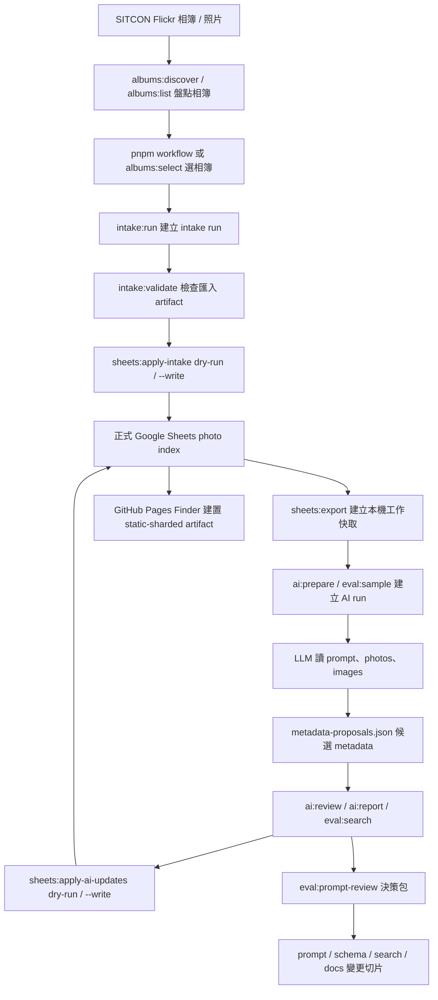

# 文件入口與狀態

這份文件整理 `docs/` 內文件的閱讀入口、目前狀態與真理來源。若其他文件和本文件的狀態描述不同，應優先回到這裡更新並修正矛盾。

## 先建立共同語言

第一次接手專案時，先看本節和下一節的資料生命週期，再依任務導向入口選 runbook。這個專案的核心不是取代 Flickr，而是在 Flickr 與 Google Sheets 之間建立可驗證、可回寫、可搜尋、可由 AI 輔助但仍由人類審核的照片索引層。

| 名詞 | 在本專案的意思 |
| --- | --- |
| 正式 Sheets | Google Sheets 中的正式照片索引。`photos`、`albums`、`import_batches` 是正式 operational data；`taxonomy` 與 `sponsorship_items` 是由 repo source 同步到 Sheets 的輔助查閱表。 |
| 本機工作快取 | `tmp/sheets-export/*.csv`，由 `pnpm sheets:export` 從正式 Sheets 匯出，供本機 validation、intake 與 AI 工具使用；可重建，不 commit。 |
| intake run | `tmp/intake-runs/<run-id>/`，一次 Flickr 相簿匯入的可審核 artifact，包含候選照片、相簿更新、匯入批次與摘要；人類確認後才用 `sheets:apply-intake` dry-run/write。 |
| AI run | `tmp/ai-runs/<run-id>/`，一次 AI 搜尋級標記工作包，通常由 `ai:prepare` 或 `eval:sample` 建立，包含 `manifest.json`、`photos.json`、`images/`、`ai-labeling-prompt.md`，模型完成後才加入 `metadata-proposals.json`。大型分片 run 另有 `/tmp/ai-labeling-shards/<run-id>/visual-audits/` 逐張檢視稽核。AI run 不是人工 review 狀態。 |
| attempt | 從既有 AI run 派生的模型/輪次比較工作包，仍符合 AI run 目錄合約，用來比較不同模型、prompt 或 rounds。 |
| prompt review 決策包 | `tmp/prompt-reviews/<review-id>/`，由 `eval:prompt-review` 產生，只彙整 evidence、角色 review 與 owner 決策，不自動呼叫外部 LLM、不自動分派審查者、不改 prompt/schema、不寫 Sheets。若需要獨立審查，操作者必須主動分派不同 agent 或不同可追溯執行 session，並記錄 review provenance。 |

## 整體資料生命週期

端到端主線是：從 Flickr 盤點相簿與照片，產生可審核的 intake artifact，經 dry-run/write 寫入正式 Sheets；公開前端讀正式 Sheets 公開資料；AI 標記與 eval 只在正式 Sheets 匯出的工作快取或 sample 上產生候選與決策 artifact，最後仍要回到 Sheets dry-run/write 與人工 review 邊界。

## 任務導向入口

如果你是以「我要完成什麼」進入專案，先用下表選一個最合適入口；需要確認資料權威、共用字串或文件分工時，再看後面的真理來源表與文件分工。這裡是第一層分流，不是完整 runbook、命令清單或 artifact inventory。

### 找圖與資料整理

| 任務 | 先從這裡開始 | 補讀或邊界提醒 |
| --- | --- | --- |
| 我要找社群、回顧、贊助或新聞稿可用照片 | [公開搜尋前端](https://sitcon.org/flickr-photo-finder/) | 正式找圖入口讀取 Google Sheets 公開資料；本機前端預覽才用 `pnpm finder:dev`，資料流看 `docs/public-frontend-architecture.md`。 |
| 我第一次整理照片，想先練習 | Google Sheets `使用說明` | 從正式照片索引進入固定練習表，不要直接在正式資料試填；整理判斷補讀 `docs/data-entry-guide.md`。 |
| 我要正式補照片欄位或檢查授權/用途 | [正式照片索引](https://docs.google.com/spreadsheets/d/1JM2QzJo5kpeILZPyTSE6gUK3z-FyRcaGhPJlYE-FMbs/edit) | 欄位速查看 `docs/photo-fields-reference.md`；欄位順序、reviewed 完整度與 approved 要求仍以 `data/photo-schema.json` 為準。 |
| 我要匯入新 Flickr 相簿 | `pnpm workflow` | 從互動式流程選相簿、建立 intake run、接續 validation 與 Sheets dry-run；Sheets 同步邊界看 `docs/sheets-sync-workflow.md`。 |
| 我要跑 AI 搜尋級標記 | `pnpm workflow` | 從 AI prepare 流程建立 `tmp/ai-runs/` 工作包；模型輸出合約看 `docs/ai-labeling-contract.md`。大型分片 run 需要逐張 visual audit，不能用 contact sheet 或多圖截圖判讀。 |
| 我要確認 AI 建議能不能採用 | `docs/ai-labeling-operator-guide.md` | 實際檢查候選值用 `pnpm ai:review -- --run-dir <dir>`；AI 候選值不等於 `reviewed`。 |
| 我要比較模型、prompt 或搜尋增益 | `pnpm eval` | 這是評估入口，不是一般照片整理主線；需要多角色 prompt 決策包時用 `pnpm eval -- --task prompt-review` 或 `pnpm eval:prompt-review`。 |

### 維護與開發

| 任務 | 先從這裡開始 | 補讀或邊界提醒 |
| --- | --- | --- |
| 我要修改公開前端 | `docs/public-frontend-architecture.md` | 先確認正式資料來源、本機 fixture/export 模式、前端模組邊界、artifact build/check 與 GitHub Pages 部署邊界。 |
| 我要修改 Apps Script | `docs/apps-script-maintenance-design.md` | 先確認 clasp 綁定、target、GeneratedConfig、Sheets-side validation 與練習表/正式表邊界。 |
| 我要新增或修改 CLI/CI smoke test | `docs/command-smoke-tests.md` | 先確認 command 是否可在無 credential CI 跑；credential、網路與 write flow 不應混進預設 smoke。 |
| 我要修改 taxonomy 或欄位 schema | `真理來源` 與 `共用字串歸屬` | 實際 source 是 `data/tag-taxonomy.json` 與 `data/photo-schema.json`；改完需依影響範圍同步 Apps Script、前端或 validation，並執行 `pnpm data:validate`。 |
| 我要修改 filter、task mode、URL key 或跨介面 field set | `docs/shared-value-governance.md` | Interface policy 來源是 `data/interface-registry.json`；改完需重新產生 Apps Script config 並執行 `pnpm shared-values:check`。 |
| 我要部署或檢查 Pages artifact | `pnpm workflow -- --task pages-build` | workflow 是日常入口；低階檢查可用 `pnpm finder:build` 後接 `pnpm finder:check`。部署版預設產生 static-sharded finder data；runtime CSV 只作為 fallback。 |
| 我要維護 Sheets 同步或練習表 | `docs/sheets-sync-workflow.md` | 先確認正式表、練習表、service account 與 dry-run/write 邊界。 |
| 我要檢查正式 Sheets 資料健康度 | `pnpm sheets:report` | 先用 `pnpm sheets:export` 更新 `tmp/sheets-export/`；風險分級與後續處理看 `docs/sheets-sync-workflow.md`。 |
| 我要管理 GA4 事件與 custom dimensions | `docs/frontend-analytics-design.md` | 後台權限與 Admin API 操作看 `docs/ga4-operations.md`。 |
| 我要交接維運權限與資產 | `docs/operations-handoff-checklist.md` | 不保存 credential；列出正式 Sheets、service account、Apps Script、GitHub Pages、GA4 與 dry-run 驗證方式。 |
| 我要定位常見維運事故 | `docs/troubleshooting.md` | 從症狀分流到 Pages artifact、Sheets public CSV、Apps Script、AI run、clasp 或 GA4 的檢查命令與 runbook。 |
| 我要理解架構決策背景與維護邊界 | `docs/adr/README.md` | ADR 只記錄決策脈絡、取捨與維護邊界；目前架構總覽仍看 `docs/project-architecture.md`。 |
| 我要理解研究、代理訪談或歷史 brief | `docs/research/README.md` | 研究文件只保存證據、限制與當時判斷；目前規則仍回到 ADR、architecture 或 runbook。 |

## AI 評估與決策子流程

上方生命週期中的 AI run 可以再展開成候選 metadata、評估與決策路線。一般照片整理仍走 `pnpm workflow`，模型、prompt、搜尋增益評估走 `pnpm eval`，需要 owner 決策前再用 `pnpm eval:prompt-review` 收斂 evidence 與角色 review 意見。`prompt-review` 只產生 review artifact，不自動呼叫外部 LLM、不自動分派審查者、不修改 prompt/schema、不寫 Google Sheets。

| 讀者 | 主要閱讀入口 | 不應混用的脈絡 |
| --- | --- | --- |
| 人類操作者 | `docs/ai-labeling-operator-guide.md`、`docs/ai-labeling-contract.md` | AI 候選值不等於人工 `reviewed` 或公開 `approved`。 |
| 只負責搜尋級標記的 LLM / agent | run 目錄的 `ai-labeling-prompt.md`、`docs/ai-labeling-contract.md`、schema、taxonomy、sponsorship items、`photos.json` 與圖片 | 不要把 operator guide、Sheets 回寫文件或先前 proposal 當成照片內容依據；分片任務不得以 contact sheet、縮圖牆或多圖截圖作為欄位判斷依據。 |
| repo 維護 agent | `AGENTS.md`、`docs/agent-maintenance-guide.md`、本文件 | 操作流程前先確認 source-of-truth 文件與 run artifact。 |
| prompt review 角色 agent | `tmp/prompt-reviews/<review-id>/input-manifest.json`、`expert-prompts/`、run 的 `metadata-review-summary.md`、`docs/ai-labeling-prompt-expert-review.md` | 角色 review 只做唯讀分析；若要獨立 review，操作者必須主動分派不同 agent 或不同可追溯執行 session，並在 `expert-reviews/` 記錄 provenance；決策包不會自動套用建議。 |

## 文件類型與撰寫規則

文件新增或改寫時，先判斷它要承擔哪一種責任，避免同一個決策在多處變成不同版本。

| 類型 | 位置 | 責任 |
| --- | --- | --- |
| 真理來源 | `data/*.json`、`config/project.json`、正式 Google Sheets、architecture/runbook | 定義目前欄位、資料、部署、操作與公開介面規則。 |
| ADR | `docs/adr/` | 記錄已採用的長期決策、背景、取捨、替代方案與重新評估條件。 |
| 研究與歷史 brief | `docs/research/` | 保存觀察、方法限制、代理訪談、owner 評估與歷史驗收 baseline；不直接承載目前規則。 |
| Runbook / architecture | `docs/*.md` | 說明目前怎麼操作、怎麼維護，以及系統現在如何運作。 |
| 評估證據 | `docs/*evaluation*.md` 或具體評估文件 | 保存模型、工具或流程評估依據；可提出調校方向，但目前規則仍要回到 contract、runbook、ADR 或 source data。 |

撰寫原則：

- 若研究結論變成長期維護邊界，新增或更新 ADR，再讓 architecture/runbook 引用 ADR。
- 研究文件可以保留當時推測與被否決的方向，但要標明文件狀態與目前規則來源。
- `docs/README.md` 只做入口、狀態與 source-of-truth map，不重複維護完整 artifact inventory。
- 欄位、受控值、顯示文字與共用 UI policy 不在文件複製清單，應引用 `data/photo-schema.json`、`data/tag-taxonomy.json` 或 `data/interface-registry.json`。

新增或修改文件時，依下表決定要改哪一層：

| 變更情境 | 主要修改位置 | 檢查 |
| --- | --- | --- |
| 新增長期決策、取捨或維護邊界 | `docs/adr/`，再由 architecture/runbook 引用 | `pnpm docs:check`、`pnpm language:check` |
| 新增研究、代理訪談、歷史 brief 或 owner 評估證據 | `docs/research/`，並更新 `docs/research/README.md` | `pnpm docs:check`、`pnpm language:check` |
| 更新目前操作流程或系統現況 | 對應的 architecture/runbook，必要時同步 `docs/README.md` 入口 | `pnpm docs:check`、相關 workflow check |
| 更新欄位、受控值、顯示文字或跨介面 policy | `data/photo-schema.json`、`data/tag-taxonomy.json`、`data/interface-registry.json` | `pnpm data:validate`、`pnpm shared-values:check` |
| 新增模型、prompt、搜尋或工具評估紀錄 | 評估文件或 `tmp/` artifact 摘要；若形成長期規則，再升格到 ADR/runbook/contract | `pnpm docs:check`、相關 eval / AI check |

## 真理來源

| 資訊 | 真理來源 | 備註 |
| --- | --- | --- |
| 照片、相簿與匯入批次欄位、欄位順序、reviewed 完整度 | `data/photo-schema.json` | 文件可以解釋判斷理由，但不應重複維護欄位清單。 |
| 受控字彙、列舉值與人類顯示文字 | `data/tag-taxonomy.json` | Apps Script、Sheets 下拉選單、GitHub Pages、文件與 validation 應從這份資料衍生。`option_labels` 是 raw value 的唯一顯示文字來源。 |
| 資料值搜尋同義詞 | `data/search-aliases.json` | 只放 raw value 的搜尋別名，供 GitHub Pages 與離線搜尋評估共用；不要放單一畫面的任務文案。 |
| 公開欄位敏感內容 warning 規則 | `data/public-sensitive-content-rules.json` | 用於本機 validation 與 Apps Script validation report；warning 不等於 hard fail，人工判斷與例外處理看 `docs/database-collaboration-strategy.md`。 |
| filter、task mode、URL key、狀態排序與跨介面欄位集合 | `data/interface-registry.json` | 只引用 schema/taxonomy 既有欄位與值，不新增資料契約；詳細分層見 `docs/shared-value-governance.md`。 |
| SITCON 2026 CFS 贊助品項 | `data/sponsorship-items.json` | 這是固定版本資料，不自動追遠端更新。 |
| 組織名稱、Flickr 帳號、GitHub 專案連結與前端標題 | `config/project.json` | SITCON 是此 repo 的預設實例；其他組織 fork 時應先改這份設定。 |
| 公開 Google Sheets ID | `config/project.json` 的 `googleSheets.spreadsheetId` | 這份 Sheets 預期可公開讀取；寫入權限由 Google Drive/Sheets 管理。 |
| GitHub Pages 前端資料流、本機資料來源與部署 artifact | `docs/public-frontend-architecture.md` | 前端現況 runbook；`pnpm finder:dev`、`pnpm finder:dev:fixture`、`pnpm finder:dev:export` 的差異以這份為準。 |
| 公開前端索引與空結果信任邊界 | `docs/adr/0007-finder-index-results-are-not-absence-proof.md` | Finder 是 Flickr 上方的索引輔助；搜尋、篩選與空結果不可作為 Flickr 照片不存在的判定。 |
| 前端使用行為分析設計 | `docs/frontend-analytics-design.md` | 導入 GA4 或分析前，先確認目前前端狀態、事件邊界、隱私限制與後續分析流程。 |
| GA4 後台操作與 service account 權限 | `docs/ga4-operations.md` | 管理 GA4 權限、service account 加入 property、custom dimensions 與 BigQuery 延後策略。 |
| GA4 custom dimensions 註冊清單 | `config/ga4-custom-dimensions.json` | 低基數 event-scoped custom dimensions 的 repo source of truth；不要加入 `photo_id`、`content_id`、`search_term`、`result_rank`。 |
| GA4 前端 measurement ID | `config/project.json` 的 `frontend.ga4MeasurementId` | 給 GitHub Pages 前端送出 GA4 event 使用。 |
| GA4 後台 property ID | `config/project.json` 的 `frontend.ga4PropertyId` | 給 GA4 Admin API 與 custom dimensions 管理工具使用；它不是 credential 或 secret。 |
| Sheets 表格讀寫技術選擇 | `docs/sheets-sync-workflow.md` | repo CLI 應以官方 Google Sheets API SDK 為主要方向；Google Drive 檔案搬運不是 Sheets 寫入主流程。 |
| Sheets 正式寫入身份 | `docs/sheets-sync-workflow.md` | 建議使用 SITCON 管理的 service account，並將 service account email 加入正式 Sheets 編輯者。 |
| AI 標記輸入與輸出格式 | `docs/ai-labeling-contract.md` | 定義 `tmp/ai-runs/<run-id>/` 的輸入檔、圖片來源、`metadata-proposals.json`、分片 visual audit 格式與驗證流程。 |
| AI 標記操作與 prompt | `docs/ai-labeling-operator-guide.md`、`prompts/ai-labeling.md` | 操作指南給人類操作者與 repo 維護 agent；prompt 是可交給模型使用的任務範本。 |
| AI 標記 prompt 角色審查決策 | `docs/ai-labeling-prompt-expert-review.md` | 記錄多角色 prompt review 的角色、共識、owner 決策與後續切片；本機 review artifact 留在 `tmp/prompt-reviews/`。 |
| 跨活動 AI 測試抽樣計畫 | `data/ai-cross-activity-sample-plan.json` | 用於建立欄位、taxonomy、prompt 與 validator 評估工作包；不是正式照片資料。 |
| AI proposal 範例 | `fixtures/ai-proposals/` | valid/invalid examples 應由 `pnpm eval:validate-fixtures` 驗證。 |
| AI 標記 review 後續交接提示 | `scripts/commands/review-ai-run.mjs` | CLI `Next:` 與 `metadata-review-summary.md` 的 `## Next Commands` 應和目前報表、比較、dry-run 流程同步。 |
| 正式照片索引資料 | Google Sheets `photos` | repo 內 `fixtures/photos.csv` 只是 sample、fixture 與匯出格式參考。 |
| 正式相簿清單資料 | Google Sheets `albums` | repo 內 `fixtures/albums.csv` 只是 sample、fixture 與匯出格式參考。 |
| 正式匯入批次資料 | Google Sheets `import_batches` | repo 內 `fixtures/import-batches.csv` 只是 sample、fixture 與匯出格式參考。 |
| 本機 Sheets 工作快取 | `tmp/sheets-export/*.csv` | 從正式 Google Sheets 匯出，供 validation 與 intake 使用；可刪除，不 commit。 |
| 正式表 Apps Script ID | `config/project.json` 的 `googleSheets.appsScriptId` | 這是正式表的 Sheet-bound Apps Script 專案 ID，供維護者重建本機 `clasp` 綁定；它不是 Google credential、OAuth token 或部署權限。 |
| 固定練習用 Google Sheets ID | `config/project.json` 的 `googleSheets.practiceSpreadsheetId` | 這份 Sheets 供教學與試驗編輯；它不是第二份正式資料庫，寫入權限由 Google Drive/Sheets 管理。 |
| 固定練習用 Apps Script ID | `config/project.json` 的 `googleSheets.practiceAppsScriptId` | 這是練習表的 Sheet-bound Apps Script 專案 ID，供維護者重建本機 `clasp` 綁定；它不是 Google credential、OAuth token 或部署權限。 |
| 練習用試算表資料包 | `tmp/sheets-practice/*.csv` | 從正式匯出資料切出的小樣本，供維護者重置固定練習表；可刪除，不 commit，不是第二份正式資料庫。 |
| 專案角色與資料流 | `docs/project-architecture.md` | 若架構改變，先更新架構總覽，再同步相關文件。 |
| 架構決策脈絡與維護邊界 | `docs/adr/README.md` | ADR 不取代架構總覽或 runbook；用來理解已採用決策的背景、取捨與長期維護方式。 |

## 背景研究與決策證據

這些文件保留研究過程、代理推測、owner 評估或歷史 brief。它們能協助理解某些 UI 或文件決策從何而來，但不取代 ADR、architecture 或資料 source of truth。

| 資訊 | 文件 | 備註 |
| --- | --- | --- |
| 公開前端代理使用者研究 | `docs/research/public-frontend-agent-research.md` | 重構前的多角色代理研究快照；不等同真人訪談，也不是目前缺口清單。 |
| 公開前端手機版代理研究 | `docs/research/public-frontend-mobile-research.md` | 針對 #5 手機版重設計的代理深訪與 owner 評估紀錄；不等同真人訪談或已完成 usability test。 |
| 公開前端使用素養代理研究 | `docs/research/public-frontend-user-literacy-research.md` | 針對一般找圖者可能誤解索引完整性的代理訪談與 Pages 文案採納紀錄；長期信任邊界看 ADR 0007。 |
| 公開前端重構需求簡報 | `docs/research/public-frontend-redesign-brief.md` | GitHub Pages 前端重構的歷史需求基準與驗收 baseline；目前已完成多數 P0/P1。 |
| AI 標記品質評估 | `docs/ai-labeling-evaluation-notes.md` | 模型 run 觀察、常見失準欄位與工具化警訊候選；目前操作規則仍看 operator guide、contract 與 ADR 0003。 |

## AI 文件責任

| 文件 | 責任 | 不是什麼 |
| --- | --- | --- |
| `docs/ai-labeling-contract.md` | AI run 輸入、輸出與 proposal 驗證合約。 | 不是操作者 runbook。 |
| `docs/ai-labeling-operator-guide.md` | 人類操作者與維護 agent 的 prepare/review/report/write 流程。 | 不是模型標記 prompt。 |
| `docs/ai-labeling-evaluation-notes.md` | 歷史模型 run、prompt 調校與工具警訊的評估證據。 | 不是目前規則或模型永久能力排名。 |
| `docs/ai-labeling-prompt-expert-review.md` | prompt review 的角色、owner 決策與後續切片紀錄。 | 不是 ADR，也不自動套用規則。 |
| `docs/adr/0003-ai-candidate-only.md` | AI 只產生候選 metadata 的長期治理邊界。 | 不取代 contract 或 operator guide 的操作細節。 |

## 共用字串歸屬

資料欄位、受控字彙、狀態與驗證規則會同時出現在 Google Sheets、GitHub Pages、Apps Script、AI report 與 CLI。新增或調整字串時，先判斷它屬於哪一層：

| 字串類型 | 維護位置 | 使用原則 |
| --- | --- | --- |
| 欄位名稱與欄位說明 | `data/photo-schema.json` | 人類介面與報表應使用 `label_zh` / `description_zh`，儲存與比對仍使用欄位 raw key。 |
| taxonomy / boolean raw value 的人類顯示文字 | `data/tag-taxonomy.json` 的 `option_labels` | 不在 Pages、Apps Script、文件或報表另寫翻譯表。 |
| sponsorship item 名稱 | `data/sponsorship-items.json` 衍生到 taxonomy | 沿用 CFS 快照名稱，不另創平行詞彙。 |
| raw value 的搜尋同義詞 | `data/search-aliases.json` | 只放會跨搜尋介面共用的別名；任務模式與 query 提示仍屬於各自產品介面。 |
| Apps Script 即時驗證文案 | `data/validation-messages.json` | 後端驗證與 sidebar 即時提示共用；不要在 HTML 內另寫同一組錯誤訊息。 |
| 人類審核輸出格式 | `scripts/lib/core/metadata-display.mjs` | CLI diff、report、CSV 等人類輸出應共用這個 helper，機器 JSON plan 維持 raw value。 |
| 版本與狀態描述 | 具體日期、hash、schema version、header shape 或目前 repo source | 避免用含糊相對詞描述版本或狀態。若是 prompt 差異，寫出 prompt hash 或「目前 repo prompt」；若是 Sheets 格式差異，寫出實際 header。 |
| 跨介面 UI policy | `data/interface-registry.json` | Pages、Apps Script 或 CLI 需要共用 filter、field set、URL key 或狀態排序時，先登錄 registry，再由使用端讀取或檢查。 |
| 單一畫面的操作文案 | 該畫面程式或文件 | 例如按鈕、空狀態與提示文字可留在當地；若跨兩個以上介面重複，應提升成共用來源。 |

## 目前狀態

### 主要操作入口

本節只列日常入口與能力分組，不維護逐項 command inventory。可執行 script 名稱以 `package.json` 的 `scripts` 為準；CLI 使用方式以各 command 的 `--help` 為準。新增、改名或移除 command 時，請執行 `pnpm docs:check` 與 `pnpm command:smoke`，避免文件中的指令名稱和實際 package script 漂移。

- 日常操作主線：`pnpm workflow` 會先說明完整資料流，再引導相簿匯入、AI prepare/review/report、大型 AI 分片流程、Sheets 維護與公開搜尋前端 artifact build/check。`pnpm eval` 是模型品質、prompt、taxonomy、跨活動樣本與 `visual_description` 搜尋增益評估入口，不是一般照片整理主線。
- 無 credential 健康檢查：`pnpm project:check` 是本機與 CI 的主要 gate，涵蓋 language/docs/shared-value governance、JavaScript syntax、command smoke、Apps Script generated config、data validation、AI fixture validation、finder tests、Pages build/check。手機篩選 UI 變更另跑 `pnpm finder:mobile-filter-smoke`。
- 文件與治理檢查：`pnpm docs:check` 檢查本機 Markdown link、docs index 覆蓋與文件中的 package script reference 是否存在；`pnpm language:check` 檢查含糊版本或狀態詞與台灣繁中技術詞彙；`pnpm shared-values:check` 檢查跨介面 registry；`pnpm command:smoke` 檢查無 credential 的 `--help` path。
- 公開前端：本機預覽用 `pnpm finder:dev`、fixture 模式用 `pnpm finder:dev:fixture`、正式匯出快取模式用 `pnpm finder:dev:export`；部署 artifact 用 `pnpm finder:build` 與 `pnpm finder:check`；前端純邏輯回歸用 `pnpm finder:test`。
- Sheets 與資料品質：公開讀取檢查用 `pnpm sheets:check`；正式工作快取用 `pnpm sheets:export`；正式資料健康度用 `pnpm sheets:report`；初始化、header 遷移、欄位值遷移、taxonomy、使用說明、練習表與 intake/AI 回寫流程都從 `docs/sheets-sync-workflow.md` 選正確 dry-run/write 路徑。
- Flickr 相簿與 intake：相簿盤點、清單、選擇與同步由 `albums:*` 工具處理；正式匯入工作包由 `pnpm intake:run` 建立，`pnpm intake:validate` 檢查，再由 `pnpm sheets:apply-intake` dry-run/write 套用。
- AI 標記與評估：AI run 準備、驗證、review、report、diff、plan、bulk/shard 狀態與 Sheets dry-run/write 由 `ai:*` 工具處理；模型/輪次 attempt、跨活動 sample、搜尋增益與 prompt review 決策包由 `eval:*` 工具處理。操作順序以 `docs/ai-labeling-operator-guide.md` 和 `docs/ai-labeling-contract.md` 為準。
- Apps Script：GeneratedConfig 由 `pnpm apps-script:build-config` 產生；clasp target、status、push、deployments 由 `apps-script:*` wrapper 依 `config/project.json` 解析，正式表是預設 target，練習表必須明確指定 `--target practice`。
- GA4：事件設計先看 `docs/frontend-analytics-design.md`；custom dimensions 與後台權限操作看 `docs/ga4-operations.md`，repo 端檢查與同步由 `analytics:dimensions:*` / `ga4:dimensions:*` scripts 包裝。

### 可用狀態與維運提醒

- Apps Script source 已進 repo，1.0 維護選單已可部署使用；可在 Sheets 內提供校對 sidebar、欄位提示、單值下拉選單、`photos` 純文字格式防護、`taxonomy` 同步、`schema_meta`、`validation_report` 與基本驗證。sidebar 會先驗證再寫入，儲存錯誤顯示在按鈕附近；載入錯誤顯示在列控制區附近。`taxonomy.label_zh` 與 `schema_meta` 都不應是空白狀態。實際 `clasp` 綁定、push 與 deploy 仍需由有權限的維護者操作。
- GitHub Pages workflow 已可產生並部署 artifact；repository Pages 來源已設定為 GitHub Actions。後續前端變更應用 `pnpm workflow -- --task pages-build` 與 GitHub Actions 部署紀錄驗證。
- 前端已加入 GA4 基礎追蹤、任務模式、照片卡片操作、候選清單與 AI 助手找圖入口事件；主要模組邊界記錄在 `docs/public-frontend-architecture.md`。後續調整事件或分析流程前，先依 `docs/frontend-analytics-design.md` 重新確認程式碼現況與事件設計。
- GA4 後台 service account 權限與 custom dimensions 操作應依 `docs/ga4-operations.md` 執行；property ID 已在 `config/project.json` 設為預設，custom dimensions 清單由 `config/ga4-custom-dimensions.json` 管理，可用 `pnpm analytics:dimensions:check` dry-run 檢查，BigQuery export 暫不自動化。
- 多人 review 仍以 Google Sheets 為主要協作介面；後續若要改善操作效率，應優先延伸 Sheets 與 Apps Script 輔助。AI 候選值寫入不等於 `curation_status = reviewed`。

## 依角色閱讀

| 角色 | 建議閱讀 |
| --- | --- |
| 第一次理解專案的人 | `README.md`、`docs/project-architecture.md`、`docs/photo-finder-mvp.md` |
| 整理照片的志工 | `README.md`、Google Sheets `使用說明`、`docs/data-entry-guide.md`、`docs/photo-fields-reference.md` |
| 技術志工 | `pnpm workflow`、`docs/project-architecture.md`、`docs/sheets-sync-workflow.md`、`docs/google-sheets-database-design.md` |
| 維護 Apps Script 的人 | `docs/apps-script-maintenance-design.md`、`data/photo-schema.json`、`data/tag-taxonomy.json` |
| 維護 GitHub Pages 前端的人 | `docs/public-frontend-architecture.md`、`docs/frontend-analytics-design.md`、`docs/ga4-operations.md`；需要理解重構背景時再讀 `docs/research/README.md`；處理搜尋信任邊界時先讀 `docs/adr/0007-finder-index-results-are-not-absence-proof.md` |
| AI / agent | `AGENTS.md`、`docs/agent-maintenance-guide.md`；若只是產生搜尋級標記 metadata，讀 run 目錄的 `ai-labeling-prompt.md` 與 `docs/ai-labeling-contract.md`；若要操作流程才讀 `docs/ai-labeling-operator-guide.md` |

## 文件分工

- `photo-finder-mvp.md`: 產品判斷與欄位取捨脈絡。
- `mvp-implementation-plan.md`: MVP 實作方向與驗證方式。
- `project-architecture.md`: 端到端架構與資料流。
- `google-sheets-database-design.md`: Google Sheets 表格設計。
- `sheets-sync-workflow.md`: Sheets 與 repo 工具同步流程。
- `apps-script-maintenance-design.md`: Apps Script 維護輔助與 `clasp` 部署原則。
- `public-frontend-architecture.md`: GitHub Pages 唯讀前端資料流、本機開發資料來源與部署 artifact runbook。
- `research/README.md`: 研究紀錄索引與撰寫規則；研究文件只保存證據與歷史脈絡，不承載目前規則。
- `research/public-frontend-agent-research.md`: 重構前的多角色代理使用者研究快照，整理任務脈絡、痛點、確認事實與推測；不是目前缺口清單。
- `research/public-frontend-mobile-research.md`: #5 手機版重設計的代理深訪、owner 評估表、P0 範圍與驗收建議；不是真人訪談結果。
- `research/public-frontend-user-literacy-research.md`: 只看 Pages 入口的一般找圖者，對索引完整性、待人工確認與空結果可能誤解的代理研究紀錄。
- `research/public-frontend-redesign-brief.md`: GitHub Pages 前端重構的歷史需求基準與驗收標準；後續回歸或 P2 規劃可用來比對。
- `frontend-analytics-design.md`: 前端使用行為分析目的、GA4 事件設計、實作前檢查與後續分析流程。
- `ga4-operations.md`: GA4 後台操作、service account 權限、custom dimensions 與 BigQuery 延後策略。
- `operations-handoff-checklist.md`: 不含 credential 的維運交接清單，列出正式 Sheets、service account、Apps Script、GitHub Pages、GA4 與 dry-run 驗證方式。
- `troubleshooting.md`: Pages、Sheets、Apps Script、AI run、clasp 與 GA4 常見事故的症狀分流、檢查命令與修復入口。
- `shared-value-governance.md`: 欄位、taxonomy、filter、task mode、URL key 與跨介面 field set 的共用值治理分層。
- `ai-readable-dataset.md`: AI 如何讀取照片索引資料。
- `ai-labeling-operator-guide.md`: AI 標記操作者與 repo 維護 agent 的 prepare-to-review、報表檢視與回寫前檢查指南；不是模型標記任務的主要 prompt。
- `ai-labeling-contract.md`: AI 搜尋級標記工作包的輸入、輸出、限制與驗證合約。
- `ai-labeling-evaluation-notes.md`: AI 標記品質評估紀錄、常見失準欄位與工具化警訊候選。
- `ai-labeling-prompt-expert-review.md`: AI 標記 prompt 多角色審查、owner 決策與後續切片紀錄；不是模型標記任務 prompt，也不是自動套用規則。
- `field-design-reflection.md`: 根據多輪真實 AI 標記結果回頭檢視欄位、taxonomy、prompt 設計，以及不導入人臉辨識與自動人名標註等產品邊界。
- `data-entry-guide.md`: 人工整理照片資料的判斷流程。
- `photo-fields-reference.md`: 欄位速查；欄位清單仍以 `data/photo-schema.json` 為準。
- `database-collaboration-strategy.md`: Sheets-first 協作、公開資料邊界與長期維護方式。
- `agent-maintenance-guide.md`: agent 與技術志工維護注意事項。
- `adr/`: 架構決策紀錄，說明重要決策的背景、取捨、目前狀態與維護邊界。
