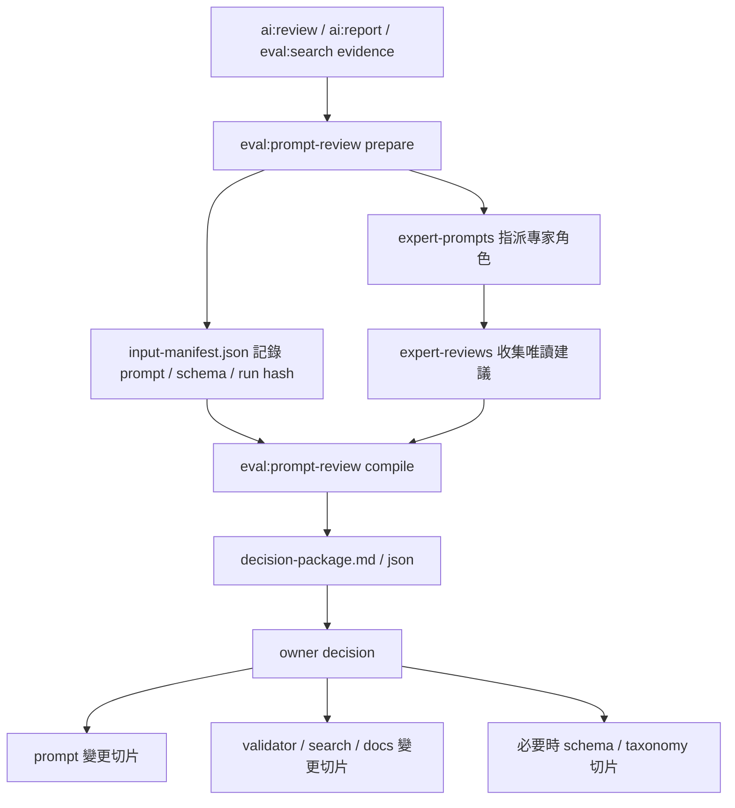

# AI 初標 Prompt 專家審查決策紀錄

## 文件狀態

這份文件記錄 AI 初標 prompt 的多專家代理審查、owner 決策與後續實作方向。它不是實際真人訪談結果，也不是模型品質保證；用途是把 prompt 調整從一次性討論轉成可追溯、可重跑、可交接的決策流程。

第一次接手專案時，請先讀 `docs/README.md` 的「先建立共同語言」與「整體資料生命週期」。本文只處理 AI run（`tmp/ai-runs/<run-id>/` 的 AI 初標工作包）已經產生 review/report/search evidence 之後的 prompt review 決策，不處理 Flickr 匯入或 Sheets 寫入。

若需要執行實際模型評估，請搭配 `pnpm eval`、`pnpm eval:sample`、`pnpm ai:review`、`pnpm ai:report` 與 `pnpm eval:search`。若只是要讓模型標註照片，仍以 run 目錄中的 `ai-labeling-prompt.md` 為主要任務入口。

## 決策流程總覽

`pnpm eval:prompt-review` 是 prompt、schema、search 與 docs 變更前的決策 gate。它彙整既有 run evidence 與專家 review；owner 接受決策包後，才另開實作切片。



若 run 目錄的 prompt hash 與 repo source 不一致，該 run 仍可作為歷史 evidence，但不能直接拿來比較成同一版 prompt 的公平模型結果。

## 審查方法

本輪審查以 repo 內的專案文件、schema、taxonomy、prompt、AI 評估紀錄與 public frontend 代理研究為依據。專家代理只做唯讀分析，不修改 repo 檔案。

核心專家角色：

| 角色 | 審查重點 |
| --- | --- |
| Prompt 架構 | 找圖成功標準、欄位分層、optional gate、confidence 策略。 |
| Schema / 資料治理 | 判斷既有欄位是否足以承接 prompt 改善，以及何時才需要 schema 或 taxonomy 變更。 |
| 評估與 workflow | 串接 `eval:sample`、`ai:review`、`ai:report`、`eval:search`，讓調整可被驗證。 |
| 人工審核成本 | 判斷哪些欄位能降低整理與找圖成本，哪些欄位會增加抽查負擔。 |

這四個角色是 prompt review 的預設核心組，不是永久唯一角色。若後續主題集中在贊助履約、公開使用風險、前端排序或特定活動類型，可在決策包中加入臨時專家角色。

## 確認事實

- SITCON Flickr Photo Finder 是 Flickr 之上的照片索引層，目標是讓籌備團隊依社群宣傳、網站橫幅、贊助提案、贊助成果報告、新聞稿、志工招募、活動回顧、設計素材與對外簡報等工作需求找照片。
- AI 初標只產生人類可審核候選值，不代表人工 `reviewed`，也不應直接產生 `public_use_status = approved`。
- `data/photo-schema.json` 已把 AI 欄位分成 baseline、recall、optional 與 human-only。這個分層可支持 prompt 重構，不需要先把每個品質問題都改成 schema 變更。
- `visual_description` 對自然語言找圖有實際價值，但前提是它保存具體可見物件、動作、文字、位置與構圖關係，而不是寫成 caption 或宣傳文案。
- `recommended_uses`、`safe_crop`、`public_use_status`、sponsorship 欄位與 `priority_level` 都是高價值但高風險欄位。它們適合用 gate 控制輸出，不適合為了提高覆蓋率而每張都填。
- 通過 validator 不等於可直接寫回。`ai:review`、`ai:report`、`eval:search` 與人工抽查仍是採用 AI proposal 前的必要檢查。

## 專家共識

### 先重構 prompt，不先改 schema

本輪共識是：第一階段不把 schema 變更當成前置條件。既有欄位足以承接找圖成功標準、欄位分層、optional gate、`visual_description` 搜尋語料與 confidence 策略調整。

若未來真實搜尋與人工審核仍顯示 `recommended_uses` 太粗，才另行評估新增 optional controlled field，例如 `content_roles` 或 `communication_intent`。這類欄位不應在本輪直接落地。

### Prompt 應以找圖成功標準開頭

Prompt 應明確告訴模型：目標不是填滿欄位，而是讓人能依工作需求找到照片、排序候選、抽查風險，並保留回寫前的人類判斷空間。

建議把目前 prompt 重排成三段：

1. baseline 欄位：圖片可讀時通常應提出。
2. recall 欄位：只要有合理可見依據就應提高找圖召回。
3. optional 欄位：只有命中明確 gate 才輸出，否則省略。

### Optional 欄位應集中成 gate table

`recommended_uses`、`safe_crop`、`public_use_status`、`sponsorship_items`、`sponsorship_tags`、`priority_level` 與 `collections` 不應散在長文中。它們應集中成一張決策表，對每個欄位列出：

- 何時輸出。
- 何時省略。
- reason 必須指出的可見證據。
- 常見誤判。

`collections` 特別需要限制。它是自由字串欄位，適合人類整理素材包，不適合讓模型自由發明名稱。建議 prompt 改成：只有 manifest、run 指示或操作者明確提供候選 collection names 時才可輸出，否則省略。

### `visual_description` 應作為搜尋語料

`visual_description` 應讓人不看圖也能知道本張照片有哪些可搜尋線索。建議要求每則描述至少包含兩類具體線索，例如人物或物件、動作、可見文字、空間位置、構圖關係、留白或遮擋。

禁止項目應保留：

- 批次比較語，例如「第 N 張」、「同批」、「鄰近照片」。
- 泛稱人物互動但缺乏具體物件或位置。
- 活動身份、單位、年份、贊助商或照片外脈絡推論。

### Confidence 策略需要固定

目前合約允許省略 confidence，但評估工具又會提醒缺少 confidence 不利人工排序。專家共識是：沒有校準資料前，不應讓模型零散輸出信心分數。

本輪建議預設策略是要求模型省略 confidence。若未來要使用 confidence，應另行定義欄位覆蓋範圍、人工 outcome 對照與排序用途。

## 分歧與保留

| 議題 | 本輪判斷 |
| --- | --- |
| 是否新增 `content_roles` / `communication_intent` | 暫緩。只有在 `recommended_uses` 經實證仍無法承接找圖任務時再評估。 |
| 是否新增 `people_count_range` | 不建議。應在前端或 AI 查詢層由 `people_count` 衍生。 |
| 是否擴張 `public_use_status` | 不建議。現有三值足夠，問題是語意、排序與抽查。 |
| 是否增加人物身份欄位 | 不建議。人臉辨識、人物聚類與自動人名標註不符合目前治理邊界。 |
| 是否讓工具自動呼叫外部 LLM 專家 | 不建議。provider、credential、成本與品質邊界不應進入 repo 工具第一版。 |

## Owner 決策紀錄

| 決策項目 | Owner 判定 | 備註 |
| --- | --- | --- |
| 建立 `pnpm eval:prompt-review` | 採納 | 需只產生 review artifact，不改 prompt/schema/Sheets。 |
| 建立專用決策文件 | 採納 | 本文件保存專案級結論；本機 review artifact 留在 `tmp/prompt-reviews/`。 |
| 第一階段先不改 schema | 採納 | Schema 變更允許討論，但需另開切片。 |
| 四專家角色作為預設核心組 | 採納 | 未來可依主題增補臨時角色。 |
| confidence 預設省略 | 待確認 | 第二階段 prompt 調整前需再次確認。 |

## 後續實作切片

### 切片 1：建立 prompt review 決策流程

新增 `pnpm eval:prompt-review`，提供：

- `prepare`：產生 evidence manifest、expert prompts、search/report links 與 `expert-reviews/` 目錄。
- `compile`：讀取 `expert-reviews/`，產生 `decision-package.md` 與 `decision-package.json`。

這個工具不自動呼叫外部 LLM，不修改 prompt，不修改 schema，不寫入 Google Sheets。

日常互動入口可用：

```bash
pnpm eval -- --task prompt-review
```

非互動或可重跑流程請直接指定 run：

```bash
pnpm eval:prompt-review -- --mode prepare --runs tmp/ai-runs/<attempt-a> tmp/ai-runs/<attempt-b> --output tmp/prompt-reviews/<review-id>
pnpm eval:prompt-review -- --mode compile --review-dir tmp/prompt-reviews/<review-id>
```

### 切片 2：將 prompt review 接入 `pnpm eval`

在 `pnpm eval -- --list` 中加入 `prompt-review` 任務，讓模型品質、prompt、taxonomy 與搜尋增益評估有一致入口。

### 切片 3：根據決策包調整 prompt

在 owner 確認決策包後，再修改 `prompts/ai-labeling.md`：

- 加入找圖成功標準。
- 依 AI layer 重排欄位流程。
- 集中 optional gate table。
- 強化 `visual_description` 搜尋語料規則。
- 限制 `collections` 輸出條件。
- 固定 confidence 策略。

### 切片 4：評估是否需要 schema 變更

若 prompt 調整後，`eval:search`、`ai:report` 或人工審核仍顯示 `recommended_uses` 無法承接需求，再另行評估 schema/taxonomy 變更。該切片必須同步規劃 Apps Script、interface registry、Sheets migration、前端、AI contract、prompt 與 validation fixtures。

## 驗證方式

工具切片至少執行：

```bash
node --check scripts/commands/build-prompt-review-package.mjs
node --check scripts/workflows/eval-workflow.mjs
pnpm eval -- --list
pnpm eval:prompt-review -- --help
pnpm eval:prompt-review -- --mode prepare --runs fixtures/ai-proposals/valid-basic fixtures/ai-proposals/warning-weak-search-visual-description --output /tmp/prompt-review-smoke
pnpm eval:prompt-review -- --mode compile --review-dir /tmp/prompt-review-smoke
pnpm eval:validate-fixtures
```

Prompt 調整切片至少執行：

```bash
pnpm eval:sample
pnpm ai:review -- --run-dir <attempt-dir>
pnpm ai:report -- --runs <old-attempt> <new-attempt>
pnpm eval:search -- --run-dir <new-attempt> --scoring idf
```

## 不應自動化的邊界

- 不自動把 AI proposal 設為 `reviewed`。
- 不自動把公開使用狀態設為 `approved`。
- 不自動推論人物姓名、身份、單位、攝影師、授權或活動外脈絡。
- 不自動將 SITCON 自有識別推成外部贊助成果。
- 不自動把決策包建議套用到 prompt、schema 或 Sheets。
