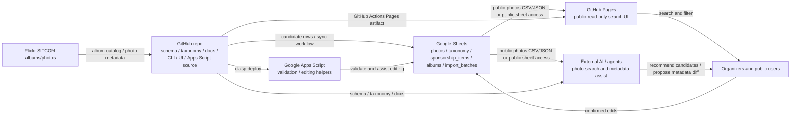

# 專案使用流程與架構

## 目的

SITCON Flickr Photo Finder 是 Flickr 之上的照片索引層，不是相簿替代品，也不是原圖保存系統。

這個專案要解決的問題是：籌備團隊常常不是用「哪一年哪個相簿」找照片，而是用工作需求找照片，例如社群宣傳、網站視覺、贊助提案、贊助成果報告、新聞稿、志工招募、活動回顧、設計素材或對外簡報。

因此資料庫的核心任務是替 Flickr 照片加上可搜尋、可排序、可被 AI 理解的 metadata，讓人類和 AI 都能更快挑出合適照片。

## 使用者與需求

| 使用者 | 主要需求 | 主要入口 |
| --- | --- | --- |
| 非技術志工 | 補標籤、檢查授權、整理用途、建立素材包。 | Google Sheets |
| 宣傳、設計、網站、公關、行銷組 | 找適合當下工作情境的照片。 | GitHub Pages、Google Sheets、AI |
| 行銷組 | 找特定贊助品項與贊助價值佐證照片。 | `sponsorship_items`、`sponsorship_tags` |
| 技術志工 | 掃描相簿、匯入資料、跑驗證、部署工具。 | repo CLI、GitHub Actions、clasp |
| AI / agent | 讀 schema、taxonomy 與照片索引，協助找圖或產生候選 metadata。 | repo 文件、公開 CSV/JSON、Google Sheets |

## 架構總覽

## 資料模型

資料權威來源請以 `docs/README.md` 的真理來源表為準；本節只說明架構中的資料模型。

主要工作表：

- `photos`: 照片索引主表。每列是一張 Flickr 照片，欄位依 `data/photo-schema.json`。
- `taxonomy`: 從 `data/tag-taxonomy.json` 同步的受控字彙。
- `sponsorship_items`: 從 `data/sponsorship-items.json` 同步的 SITCON 2026 CFS 贊助品項固定版本資料。
- `albums`: 程式從 SITCON Flickr 盤點出的相簿清單，以及每本相簿最後一次處理日期。
- `import_batches`: 每次匯入相簿或照片的批次紀錄。
- `schema_meta`: Sheets 目前使用的 schema、taxonomy 與同步狀態。

`photos` 主表本身就是公開照片索引。公開 CSV/JSON 只是同欄位匯出，不是額外篩選表。

## 維護流程

維護流程從 SITCON Flickr 相簿開始：

1. repo 工具盤點 SITCON Flickr 相簿清單，更新 Google Sheets `albums`。
2. 使用者從 `albums` 選擇本次要處理的相簿。
3. 技術志工或 agent 掃描選定相簿，比對 Google Sheets `photos` 既有 `photo_id`。
4. 工具產生一次 intake run artifact，包含缺少照片的最低必要欄位、更新後的 `albums.last_processed_at`、`import_batches` 與摘要。
5. 人類檢查 run artifact 後，透過官方 Google Sheets API SDK 寫入工具套用到 Google Sheets；新照片可以直接由志工在 Google Sheets 補資料，也可以先由 AI 產生候選 metadata。
6. AI 候選值必須以 diff 形式給人類確認，確認後才回寫。
7. Apps Script 在 Sheets 內提供即時提示；必要時匯出資料並執行 repo validation。

匯入階段最低必要欄位、`reviewed` 完整度與 `approved` 使用要求由 `data/photo-schema.json` 定義，並由 `pnpm validate:data` 檢查。文件只說明流程與判斷，不另外維護欄位清單。

## 找圖流程

找圖流程應把自然語言需求拆成可搜尋條件：

- 場景與畫面內容：`scene_tags`。
- 情緒與宣傳感受：`mood_tags`。
- 工作用途或素材包：`recommended_uses`、`collections`。
- 贊助品項與贊助價值：`sponsorship_items`、`sponsorship_tags`。
- 畫面條件：`people_count`、`orientation`、`safe_crop`、`has_negative_space`。

搜尋後再依 `public_use_status`、`curation_status`、`priority_level` 排序與提醒。使用者採用前仍應回到 Flickr 確認原圖、credit 與授權。

找圖結果不應只依 `reviewed` 篩掉其他照片。SITCON Flickr 照片量很大，`unreviewed` 與 `ai_labeled` 仍可用於探索，但必須在排序與提示上清楚標示。

## 部署流程

公開前端與 Sheets 維護工具分開部署：

- GitHub Pages 應透過 GitHub Actions 發布 artifact，不應直接把整個 repo root 當成 Pages source。
- Apps Script 應透過 `clasp` 部署。Apps Script source 應保存在 repo 中，讓修改能被 review，也讓未來 agent 能理解目前部署內容。
- `clasp` credential、Google API credential、OAuth token cache、第三方工具 token 與 AI API key 都不應 commit。

## Repo 的責任

Repo 保存：

- schema 與欄位文件。
- taxonomy 與贊助品項固定版本資料。
- validation script。
- Flickr 相簿與照片匯入工具。
- Apps Script source 與 clasp 部署文件。
- GitHub Pages 前端 source。
- AI/agent 維護指南與資料解讀文件。

Repo 不保存：

- 正式 Google Sheets 完整資料快照。
- Google Drive、Google API、OAuth、第三方工具或 AI API credential。
- 原圖檔案。
- 私人授權資訊或不該公開的內部資料。

## 目前 MVP 判斷

目前最重要的不是導入正式後台或 PostgreSQL，而是先讓以下流程成立：

1. 技術志工或 agent 能從 SITCON Flickr 盤點目前有哪些相簿。
2. 使用者能從已盤點的相簿清單選擇本次要處理哪一本。
3. 技術志工或 agent 能掃描選定相簿並匯入缺少照片。
4. 非技術志工能在 Google Sheets 補 metadata。
5. Apps Script 能用 repo 規則提供即時驗證與提示。
6. GitHub Pages 和外部 AI 能讀同一份公開照片索引。
7. 真實使用者能用工作需求找到照片，並回饋標籤或欄位是否足夠。

目前 repo 已有本機相簿盤點 CLI、`fixtures/albums.csv` fixture 格式、可回寫 Google Sheets `albums` 的 CSV 產生流程、從正式 Sheets 匯出工作 CSV 的 SDK 工具、從匯出 `albums.csv` 列出與篩選相簿的 CLI、互動式選擇單本相簿的 CLI、從選定相簿產生 intake run artifact 的流程、以官方 Google Sheets API SDK 套用初始化 CSV 與 intake run artifact 的 dry-run/write 工具，以及 AI 初標候選 metadata 的 prepare/review/diff/plan/apply 流程。尚未完成的是讓選擇流程直接讀正式 Sheets API 而不需要先匯出工作 CSV、Apps Script source 與 `clasp` deploy，以及 GitHub Pages artifact deploy。

若未來真的出現權限分層、非公開欄位、審核歷程、多人衝突或查詢效能問題，再評估正式資料庫或後台。
